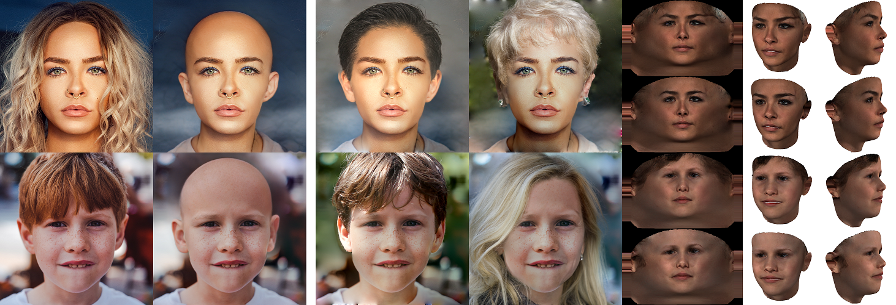
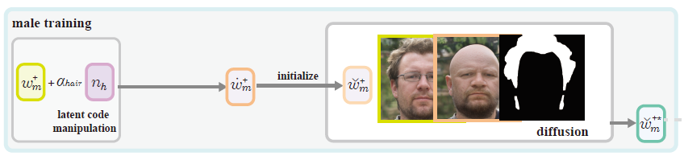
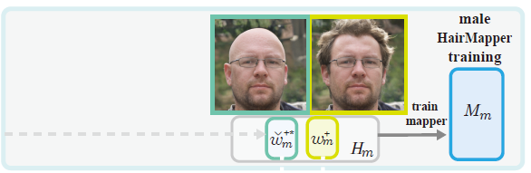
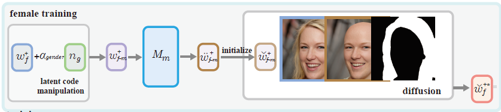
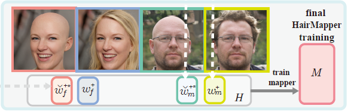

# HairMapper: Removing Hair from Portraits Using GANs

HairMapper is a hair-removal network that can be applied in hair design and 3D face reconstruction.



Published in **[2022 IEEE/CVF Conference on Computer Vision and Pattern Recognition](https://cvpr2022.thecvf.com/) (CVPR’2022)**

[Yiqian Wu](https://onethousandwu.com/), [Yongliang Yang](http://www.yongliangyang.net/), [Xiaogang Jin*](http://www.cad.zju.edu.cn/home/jin)

<div align="center">

[](https://onethousandwu.com/HairMapper.github.io/)
[](https://openaccess.thecvf.com/content/CVPR2022/html/Wu_HairMapper_Removing_Hair_From_Portraits_Using_GANs_CVPR_2022_paper.html)
[](http://www.cad.zju.edu.cn/home/jin/cvpr2022/Supplementary_Materials.pdf)
[](https://youtu.be/UNtgpphVR2w)
[](https://github.com/oneThousand1000/non-hair-FFHQ)
[](https://github.com/oneThousand1000/HairMapper)

</div>


**Abstract:**

Removing hair from portrait images is challenging due to the complex occlusions between hair and face, as well as the lack of paired portrait data with/without hair. To this end, we present a dataset and a baseline method for removing hair from portrait images using generative adversarial networks (GANs). Our core idea is to train a fully connected network **HairMapper** to find the direction of hair removal in the latent space of StyleGAN for the training stage. We develop a new separation boundary and diffuse method to generate paired training data for males, and a novel ''female-male-bald'' pipeline for paired data of females. Experiments show that our method can naturally deal with portrait images with variations on gender, age, etc. We validate the superior performance of our method by comparing it to state-of-the-art methods through extensive experiments and user studies. We also demonstrate its applications in hair design and 3D face reconstruction.

## License

**You can use, redistribute, and adapt this software for NON-COMMERCIAL purposes only**.

## Demo

 [](https://colab.research.google.com/github/oneThousand1000/HairMapper/blob/master/notebooks/HairMapper.ipynb)


## Requirements

1. Windows (not tested on Linux yet)
2. Python 3.7
3. NVIDIA GPU + CUDA11.1 + CuDNN

# Install

1. ```bash
   git clone git@github.com:oneThousand1000/HairMapper.git
   ```
   
1. Download the following pretrained models, put each of them to **path**:

   | model                                                        | path                               |
   | ------------------------------------------------------------ | ---------------------------------- |
   | [StyleGAN2-ada-Generator.pth](https://drive.google.com/file/d/1EsGehuEdY4z4t21o2LgW2dSsyN3rxYLJ/view?usp=sharing) | ./ckpts                            |
   | [e4e_ffhq_encode.pt](https://drive.google.com/file/d/1cUv_reLE6k3604or78EranS7XzuVMWeO/view) | ./ckpts                            |
   | [model_ir_se50.pth](https://drive.google.com/file/d/1GIMopzrt2GE_4PG-_YxmVqTQEiaqu5L6/view?usp=sharing) | ./ckpts                            |
   | [face_parsing.pth](https://drive.google.com/file/d/1IMsrkXA9NuCEy1ij8c8o6wCrAxkmjNPZ/view?usp=sharing) | ./ckpts                            |
   | [vgg16.pth](https://drive.google.com/file/d/1EPhkEP_1O7ZVk66aBeKoFqf3xiM4BHH8/view?usp=sharing) | ./ckpts                            |
   | [classification_model.pth](https://drive.google.com/file/d/1SSw6vd-25OGnLAE0kuA-_VHabxlsdLXL/view?usp=sharing) | ./classifier/gender_classification |
   | [classification_model.pth](https://drive.google.com/file/d/1n14ckDcgiy7eu-e9XZhqQYb5025PjSpV/view?usp=sharing) | ./classifier/hair_classification   |

​	face_parsing.pth from: https://github.com/switchablenorms/CelebAMask-HQ/tree/master/face_parsing ([79999_iter.pth](https://drive.google.com/file/d/1eP90uPItdAy1czivugAM3ZK68OdY2pfe/view?usp=sharing))

​	e4e_ffhq_encode.pt from: https://github.com/omertov/encoder4editing

​	model_ir_se50.pth from: https://github.com/orpatashnik/StyleCLIP

The StyleGAN2-ada-Generator.pth contains the same model parameters as the original [stylegan2](https://github.com/NVlabs/stylegan2) pkl model `stylegan2-ffhq-config-f.pkl`.

2. Create conda environment:

   ```
   conda create -n HairMapper python=3.7
   activate HairMapper
   ```

3. [**StyleGAN2-ada requirements**](https://github.com/NVlabs/stylegan2-ada-pytorch): The code relies heavily on custom PyTorch extensions that are compiled on the fly using NVCC. On Windows, the compilation requires Microsoft Visual Studio. We recommend installing [Visual Studio Community Edition](https://visualstudio.microsoft.com/vs/) and adding it into `PATH` using `"C:\Program Files (x86)\Microsoft Visual Studio\<VERSION>\Community\VC\Auxiliary\Build\vcvars64.bat"`.

   Please modify `compiler path` in `./styleGAN2_ada_model/stylegan2_ada/torch_utils/custom_ops.py` according to your own Microsoft Visual Studio installation path (default: `C:\Program Files (x86)\Microsoft Visual Studio`).
   
   ```python
   def _find_compiler_bindir():
       patterns = [
           '''
           	modify the compiler dir according to your own VS installation path
           ''' 
       ]
       for pattern in patterns:
           matches = sorted(glob.glob(pattern))
           if len(matches):
               return matches[-1]
       return None
   ```
   
3. Then install other dependencies by

   ```
   pip install torch===1.7.1+cu110 torchvision===0.8.2+cu110 torchaudio===0.7.2 -f https://download.pytorch.org/whl/torch_stable.html
   ```

   ```
   pip install -r requirements.txt
   ```

We modified the stylegan-ada pytorch version to output latent codes in `Z, W, W+` and `StyleSpace` more conveniently. 

Since we find that getting those CUDA extensions to run on Windows is a hassle ([stytlegan2-ada issue#97](https://github.com/NVlabs/stylegan2-ada-pytorch/issues/97)), we also modified the stylegan-ada **so that you can choose to use a slow reference implementation** of `upfirdn2d()` and `bias_act()` (slower, but can be directly used without compiling CUDA extensions). 

For those who **can not compile the CUDA extensions successfully**, please set `USING_CUDA_TO_SPEED_UP = False`  in `styleGAN2_ada_model/stylegan2_ada/torch_utils/ops/bias_act.py` and `styleGAN2_ada_model/stylegan2_ada/torch_utils/ops/upfirdn2d.py` to use the slow reference implementation.

# Models

Please fill out this google form for pre-trained models access:

https://forms.gle/a5pRbE3yxEr7sZDm7

Then download and put the pre-trained models to **path**:

| model                                                | path                                   |
| ---------------------------------------------------- | -------------------------------------- |
| Final HairMapper (can be applied to female and male) | mapper/checkpoints/final/best_model.pt |
| Man HairMapper (can only be applied to male)         | mapper/checkpoints/man/best_model.pt   |


# Testing

Directly use our pre-trained model for hair removal.

**step1:**

Real images **should be extracted and aligned using DLib and a function from the original FFHQ dataset preparation step**, you can use the [image align code](https://github.com/Puzer/stylegan-encoder/blob/master/align_images.py) provided by [stylegan-encoder](https://github.com/Puzer/stylegan-encoder).

Please put the aligned real images to **./test_data/origin** (examplar data can be found in ./data/test_data/final/origin).

**step2:**

Then using encoder4editing to get the corresponding latent codes:

```
cd encoder4editing
python encode.py  --data_dir ../test_data
```

latent codes will be saved to `./test_data/code`.

**step3:**

Then run HairMapper:

```python
cd ../
python main_mapper.py  --data_dir ./test_data
```

If you want to perform an additional diffusion (slower, but can achieve better results):

```python
python main_mapper.py  --data_dir ./test_data --diffuse
```


# Training

**Considering that our method involves several optimizations and several network trainings, we provide a step-by-step training procedure.**

## Data Preparation (Sec 3.2)

Generate D_0 dataset:

```python
python step1_generate_data.py --dataset_name D0 --num DatasetSize
```

Generate D_noise dataset:

```python
python step1_generate_data.py --dataset_name Dnoise --num DatasetSize --add_noise
```

Datasets will be saved to `./training_runs/dataset/D0` and `./training_runs/dataset/Dnoise`.

## Boundary Training (Sec 3.3)

There should be enough bald-data in D0 to train a hair separation boundary, but a randomly sampled dataset consists of 10000-images may only contains 100 bald-images. So that **we recommend you to directly use our pre-trained male hair separation boundary in `./data/boundaries/stylegan2_ada/coarse/stylegan2_ffhq_hair_w_male` and gender separation boundary in `./data/boundaries/stylegan2_ada/coarse/stylegan2_ffhq_gender_styleflow`**. 

Or you can train male hair separation boundary on D_0 for yourself. <u>(not recommended)</u>

```python
python step2_train_man_hair_coarse_boundary.py  --output_dir $HairBoundaryDir$  --dataset_path ./training_runs/dataset/D0
```

Train gender separation boundary on StyleFlow results. (We prepared the gender transition results in `./data/styleflow_gender_training_data`)

```python
python step2_train_gender_boundary.py --output_dir $GenderBoundaryDir$ --dataset_path ./data/styleflow_gender_training_data 
```


## Male Hair Removal (Sec 3.4)



**For D_0**

```python
python step3_train_bald_male_data.py  --dataset_name D0 --num 2500
```

to use your own hair boundary:

```python
python step3_train_bald_male_data.py --dataset_name D0  --hair_boundary_dir $HairBoundaryDir$ --num 2500
```

Results will be saved to `./training_runs/male_training/D0`

**For D_noise**

```python
python step3_train_bald_male_data.py --dataset_name Dnoise --num 2500
```

to use your own hair boundary:

```python
python step3_train_bald_male_data.py  --dataset_name Dnoise  --hair_boundary_dir $HairBoundaryDir$  --num 2500
```

Results will be saved to `./training_runs/male_training/Dnoise`


## Male Mapper Training (Sec 3.5)



First, prepare training data:

```python
python step4_male_mapper_data_preparation.py  --dataset_name D0  --noise_dataset_name Dnoise --mapper_name male_mapper
```

Training data list will be saved to `./training_runs/male_mapper/data`

Train male mapper:

```python
python train_mapper.py --mapper_name male_mapper --max_steps 52000
```


## Female Hair Removal (Sec 3.6)



```python
python step6_train_bald_female_data.py  --dataset_name D0  --male_mapper_name male_mapper --num 2500 
```

```python
python step6_train_bald_female_data.py  --dataset_name Dnoise --male_mapper_name male_mapper --num 2500
```

Results will be saved to `./training_runs/female_training/D0`

or use the pre-trained male mapper:

```
python step6_train_bald_female_data.py  --dataset_name D0  --mapper_ckpt_path mapper/checkpoints/man/best_model.pt --num 2500
```

```
python step6_train_bald_female_data.py  --dataset_name Dnoise  --mapper_ckpt_path mapper/checkpoints/man/best_model.pt --num 2500
```

Results will be saved to `./training_runs/female_training/Dnoise`


## Final Mapper Training (Sec 3.6)



First, prepare training data:

```python
python step7_final_mapper_data_preparation.py --dataset_name D0 --noise_dataset_name Dnoise --mapper_name final_mapper 
```

Training data list will be saved to `./training_runs/final_mapper/data`

Train final mapper:

```python
python train_mapper.py --mapper_name final_mapper --max_steps 26000
```

## Contact

onethousand@zju.edu.cn / [onethousand1250@gmail.com](mailto:onethousand1250@gmail.com)

## Citation

```
@InProceedings{Wu_2022_CVPR,
    author    = {Wu, Yiqian and Yang, Yong-Liang and Jin, Xiaogang},
    title     = {HairMapper: Removing Hair From Portraits Using GANs},
    booktitle = {Proceedings of the IEEE/CVF Conference on Computer Vision and Pattern Recognition (CVPR)},
    month     = {June},
    year      = {2022},
    pages     = {4227-4236}
}
```

## Reference and Acknowledgements

We thanks the following works:

[stylegan2-ada-pytorch](https://github.com/NVlabs/stylegan2-ada-pytorch)

[StyleCLIP](https://github.com/orpatashnik/StyleCLIP)

[encoder4editing](https://github.com/omertov/encoder4editing)

[InterFaceGAN](https://github.com/genforce/interfacegan)

[idinvert](https://github.com/genforce/idinvert)

```
@InProceedings{Patashnik_2021_ICCV,
    author    = {Patashnik, Or and Wu, Zongze and Shechtman, Eli and Cohen-Or, Daniel and Lischinski, Dani},
    title     = {StyleCLIP: Text-Driven Manipulation of StyleGAN Imagery},
    booktitle = {Proceedings of the IEEE/CVF International Conference on Computer Vision (ICCV)},
    month     = {October},
    year      = {2021},
    pages     = {2085-2094}
}
@inproceedings{zhu2020indomain,
  title     = {In-domain GAN Inversion for Real Image Editing},
  author    = {Zhu, Jiapeng and Shen, Yujun and Zhao, Deli and Zhou, Bolei},
  booktitle = {Proceedings of European Conference on Computer Vision (ECCV)},
  year      = {2020}
}
@inproceedings{shen2020interpreting,
  title     = {Interpreting the Latent Space of GANs for Semantic Face Editing},
  author    = {Shen, Yujun and Gu, Jinjin and Tang, Xiaoou and Zhou, Bolei},
  booktitle = {CVPR},
  year      = {2020}
}
@article{tov2021designing,
  title={Designing an Encoder for StyleGAN Image Manipulation},
  author={Tov, Omer and Alaluf, Yuval and Nitzan, Yotam and Patashnik, Or and Cohen-Or, Daniel},
  journal={arXiv preprint arXiv:2102.02766},
  year={2021}
}
@inproceedings{Karras2020ada,
  title     = {Training Generative Adversarial Networks with Limited Data},
  author    = {Tero Karras and Miika Aittala and Janne Hellsten and Samuli Laine and Jaakko Lehtinen and Timo Aila},
  booktitle = {Proc. NeurIPS},
  year      = {2020}
}
```

